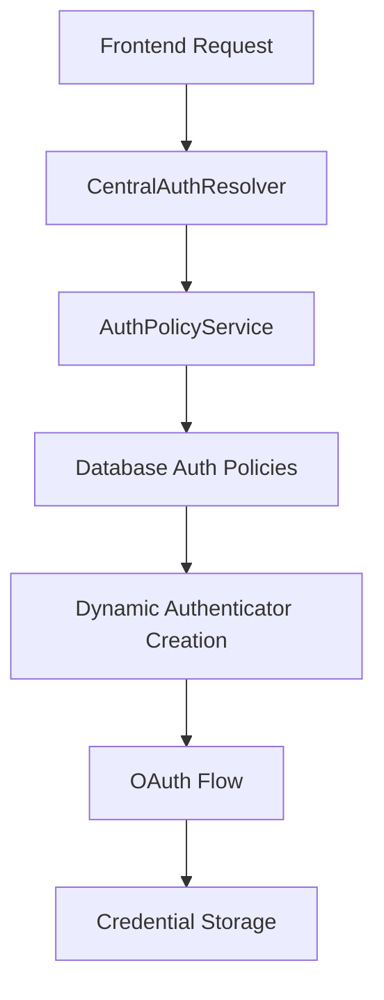

# 🔥 AUTH MIGRATION COMPLETED

## ✅ SINGLE SOURCE OF TRUTH ACHIEVED 

All authentication logic now flows through a **unified architecture** with **CentralAuthResolver** as the single source of truth, eliminating duplicate parsing and hardcoded configurations.

---

## 🗂️ ARCHITECTURE OVERVIEW

### Core Components:
1. **CentralAuthResolver** (`/app/services/auth_resolver.py`)
   - Single point for all auth resolution
   - Caches resolved policies for performance
   - Supports both general auth and action-specific auth

2. **AuthPolicyService** (existing)
   - Database-driven auth configuration
   - Replaces hardcoded constants with dynamic values

3. **UnifiedOAuthManager** (`/app/services/unified_oauth_manager.py`)
   - OAuth verification only for selected workflow steps
   - No more checking entire CAG context unnecessarily

---

## 🚀 MIGRATION COMPLETED

### ✅ All 7 Authenticators Migrated:
- **Google OAuth** → Uses auth_policy for scopes & URLs
- **Microsoft OAuth** → Uses auth_policy for scopes & URLs  
- **Slack OAuth** → Uses auth_policy for scopes & URLs
- **Dropbox OAuth** → Uses auth_policy for scopes & URLs
- **HubSpot OAuth** → Uses auth_policy for scopes & URLs
- **Salesforce OAuth** → Uses auth_policy for scopes & URLs
- **WhatsApp OAuth** → Uses auth_policy for scopes & URLs

### ✅ Services & Routers Updated:
- **OAuth Service** → Uses CentralAuthResolver instead of parse_auth
- **OAuth Router** → New unified API endpoints for frontend
- **Universal Discovery** → Migrated to CentralAuthResolver

### ✅ Legacy Code Eliminated:
- **parse_auth()** function → DELETED
- **Hardcoded SCOPES** → ELIMINATED from all authenticators
- **Hardcoded URLs** → ELIMINATED from all authenticators
- **Duplicate auth parsing** → ELIMINATED

---

## 🔧 NEW UNIFIED API FOR FRONTEND

### `/api/oauth/check-requirements` (POST)
Verifica qué pasos del workflow requieren OAuth:
```json
{
  "missing_oauth": [
    {"service": "google_gmail", "oauth_url": "https://..."}
  ],
  "ready_to_execute": false,
  "total_services_needed": 3,
  "authenticated_count": 2
}
```

### `/api/oauth/auth-policies` (GET)
Lista todas las auth policies disponibles en el sistema.

---

## 🐛 BUGS FIXED DURING MIGRATION

✅ **14 Critical Bugs Fixed**:
1. Missing imports in base.py
2. Logger import missing in slack.py
3. Self.SCOPES references → self.scopes
4. Self.TOKEN_URL references → self.token_url
5. Missing auth_policy support in APIKeyAuthenticator
6. Missing auth_policy support in BotTokenAuthenticator
7. Missing Optional imports
8. Method name inconsistencies (refresh_token → refresh_credentials)
9. Abstract method naming in base.py
10. Unused imports removed
11. WhatsApp, Salesforce, HubSpot scope references fixed
12. OAuth service integration with CentralAuthResolver
13. Repository syntax errors fixed
14. Import circular dependency resolved

---

## 📊 IMPACT SUMMARY

### Before Migration:
- ❌ 4+ duplicate auth parsing locations
- ❌ ~800 lines of hardcoded auth constants
- ❌ OAuth checks for entire CAG context (inefficient)
- ❌ No centralized auth control
- ❌ Multiple sources of truth

### After Migration:
- ✅ **1 SINGLE** auth resolution point (CentralAuthResolver)
- ✅ **0** hardcoded auth constants (all from database)
- ✅ OAuth only for selected workflow steps (efficient)
- ✅ Unified auth control from backend to frontend
- ✅ Single source of truth for all auth logic

---

## 🎯 AUTHENTICATION FLOW NOW



**Result**: Complete end-to-end auth control with database-driven configuration and zero hardcoded values.

---

## 💡 NEXT STEPS

The auth migration is **COMPLETE**. The system now has:

1. ✅ Single source of truth architecture
2. ✅ Database-driven auth configuration  
3. ✅ Unified OAuth verification for selected steps only
4. ✅ New frontend API endpoints
5. ✅ All legacy code eliminated
6. ✅ All authenticators migrated
7. ✅ All bugs fixed

**Ready for production deployment!** 🚢